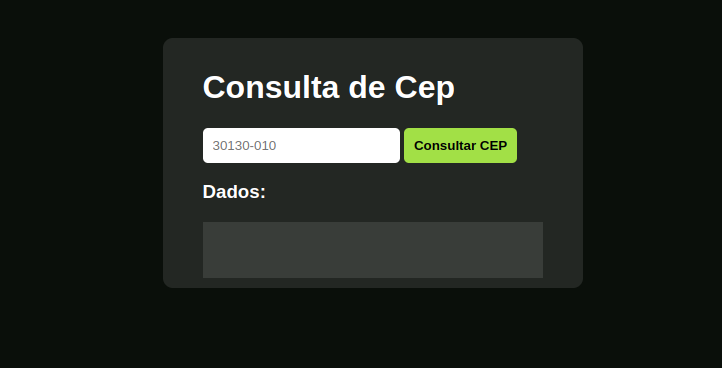

### Buscador de endereço

- Consumo da API [ViaCEP](https://viacep.com.br)                 
- Aplicação para renderizar endereço via a busca de um CEP pela API.

:pushpin: [Aplicação](https://pesquisa-cep-gules.vercel.app/)

  

